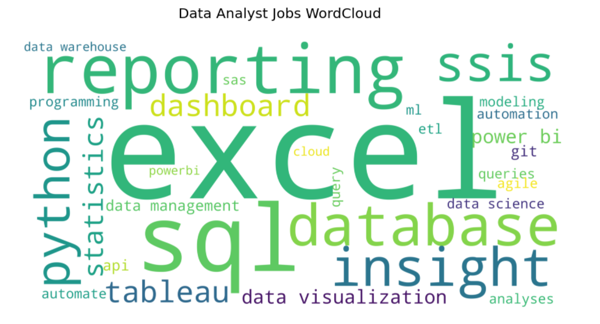

## Overview

The objective of this project is to scrape Indeed.ca to collect job postings and then process them to extract the most commonly listed skills on those job postings into a WordCloud. The purpose is to aid your job search to quickly identify what are some of the most requested skills for a job you are looking for. In this project, I am using "Data Analyst" as the job title of interest.

This project uses numerous libraries including Pandas, Numpy, BeautifulSoup, NLTK, Scikit-Learn, and WordCloud.

